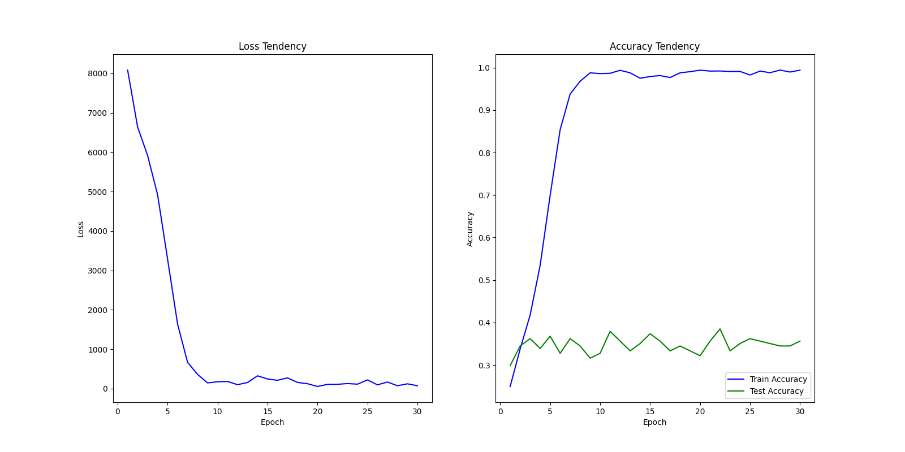

## 项目进度报告

### 4.25 ~ 5.8

#### 1. 项目进展

首先基于 PyTorch 搭建了一个简单的 CNN 基本框架，并得到了初步的运行结果。代码位于 `src/main.py` 中。模型由4层卷积层和1层全连接层组成，结构较为简单，且对原始数据没有作另外的处理，所以预计该模型的分类效果较差。

模型的初步运行结果如下：
```
epoch:  1       |        train accuracy:  24.95%        |        loss:  8085.953878521919       |        test accuracy:  29.88%
epoch:  2       |        train accuracy:  33.79%        |        loss:  6638.890607714653       |        test accuracy:  34.48%
epoch:  3       |        train accuracy:  41.79%        |        loss:  5918.758317232132       |        test accuracy:  36.20%
epoch:  4       |        train accuracy:  53.48%        |        loss:  4919.836557030678       |        test accuracy:  33.90%
epoch:  5       |        train accuracy:  69.94%        |        loss:  3284.9610074162483      |        test accuracy:  36.78%
epoch:  6       |        train accuracy:  85.40%        |        loss:  1637.2050406336784      |        test accuracy:  32.75%
epoch:  7       |        train accuracy:  93.78%        |        loss:  665.7362577915192       |        test accuracy:  36.20%
epoch:  8       |        train accuracy:  96.79%        |        loss:  359.71187787875533      |        test accuracy:  34.48%
epoch:  9       |        train accuracy:  98.77%        |        loss:  143.88181293569505      |        test accuracy:  31.60%
epoch:  10      |        train accuracy:  98.58%        |        loss:  173.2406180202961       |        test accuracy:  32.75%
epoch:  11      |        train accuracy:  98.67%        |        loss:  179.66354236751795      |        test accuracy:  37.93%
epoch:  12      |        train accuracy:  99.37%        |        loss:  98.99419784522615       |        test accuracy:  35.63%
epoch:  13      |        train accuracy:  98.77%        |        loss:  154.13164734095335      |        test accuracy:  33.33%
epoch:  14      |        train accuracy:  97.50%        |        loss:  323.96445006877184      |        test accuracy:  35.05%
epoch:  15      |        train accuracy:  97.91%        |        loss:  243.56742891669273      |        test accuracy:  37.35%
epoch:  16      |        train accuracy:  98.12%        |        loss:  209.97899491898715      |        test accuracy:  35.63%
epoch:  17      |        train accuracy:  97.66%        |        loss:  272.1701627410948       |        test accuracy:  33.33%
epoch:  18      |        train accuracy:  98.77%        |        loss:  155.96357196569443      |        test accuracy:  34.48%
epoch:  19      |        train accuracy:  99.05%        |        loss:  123.00837004603818      |        test accuracy:  33.33%
epoch:  20      |        train accuracy:  99.40%        |        loss:  53.76045500487089       |        test accuracy:  32.18%
epoch:  21      |        train accuracy:  99.18%        |        loss:  106.18799130097614      |        test accuracy:  35.63%
epoch:  22      |        train accuracy:  99.21%        |        loss:  108.27148340456188      |        test accuracy:  38.50%
epoch:  23      |        train accuracy:  99.10%        |        loss:  127.58836902212352      |        test accuracy:  33.33%
epoch:  24      |        train accuracy:  99.10%        |        loss:  112.05609507812187      |        test accuracy:  35.05%
epoch:  25      |        train accuracy:  98.26%        |        loss:  219.49138341099024      |        test accuracy:  36.20%
```


可以看到，尽管该模型在训练过程中对训练集的 loss 收敛较快，准确率提升较高，但对于测试集的最优准确率仅在 36% 附近。这说明该模型的泛化能力很差，并且可能出现了一定程度的过拟合。

#### 2. 后续规划

1. 首先改进 CNN 模型的构造，使用不同的神经网络结构和技术，如分块网络和残差网络等。
2. 对原始数据进行数据增强、数据清洗等预处理，以提高模型的泛化性。
3. 在训练过程中使用正则化技术，尽可能降低模型过拟合的风险。
4. 在完成上述步骤后对超参数进行调整，以追求同等条件下更好的结果。
5. 采用集成学习的思想，尝试集成多个模型，观察模型的效果是否有所改善。