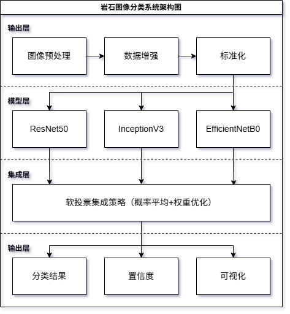
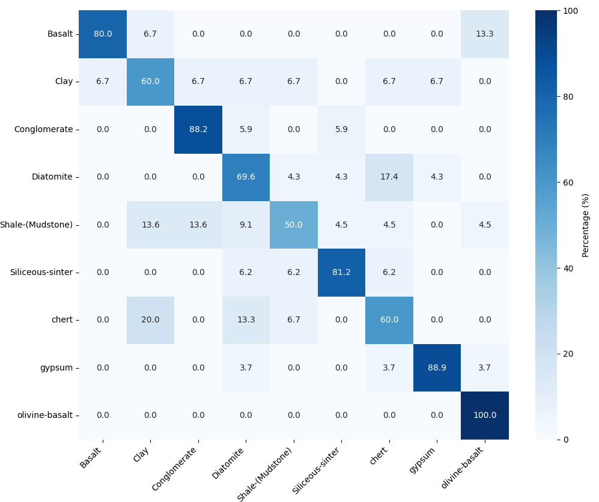
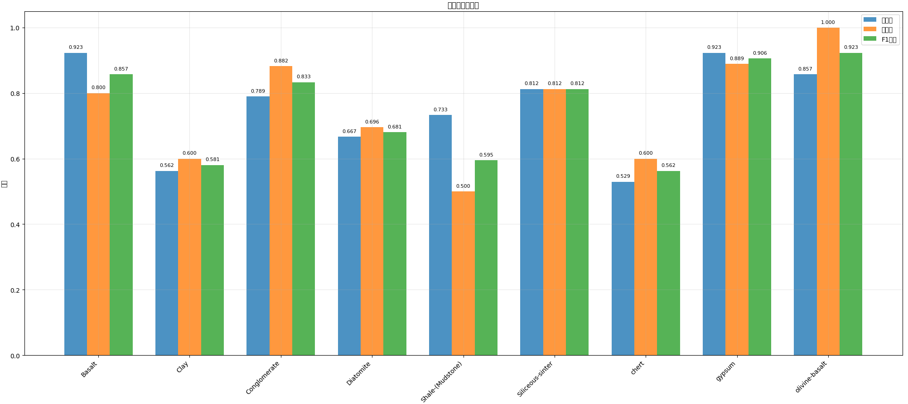
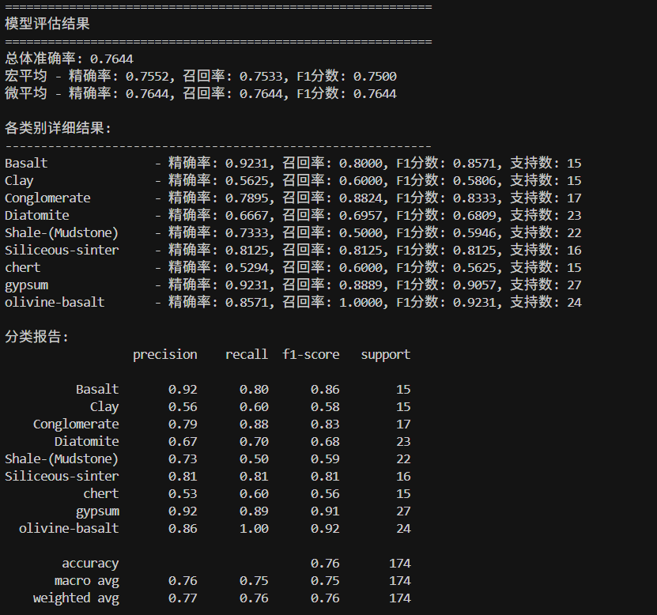
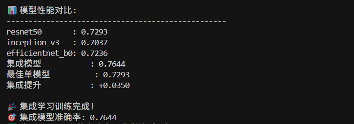
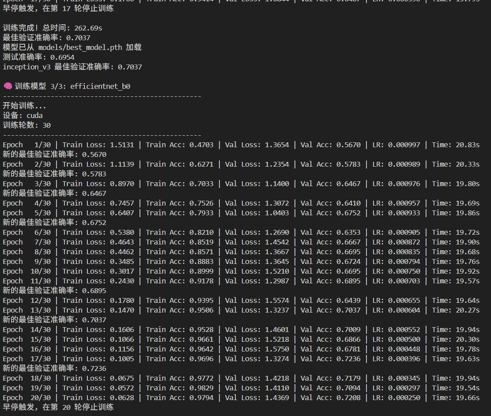

# 基于深度学习的岩石图像分类系统

|学号|姓名|具体贡献|
|-|-|-|
||||
|22336296|张鸿锴|1. 项目初期搭建自定义 CNN 模型，根据初期问题探索项目未来方向<br>2. 项目中期在项目框架的基础上添加了 InceptionV3、DenseNet、VGG 模型，并调整模型参数和冻结策略，测试了所有单模型的分类性能<br>3. 测试了多种模型集成组合和策略，得出准确率最高的模型组合（ResNet50，InceptionV3 和 EfficientNetB0）<br>4. 在项目框架上添加了模型测试脚本 `test.py` 并支持项目结果验证|
|22368015|邓文轩||

---

## 摘要

本项目开发了一个基于深度学习的岩石图像分类系统，旨在解决地质学中岩石自动识别的问题。系统采用迁移学习技术，结合ResNet50、Inception V3和EfficientNet B0三种预训练模型，通过集成学习策略实现对9种岩石类型的自动分类。项目在4,212张岩石图像数据集上进行了训练和测试，最终达到了76.44%的分类准确率，相比最佳单模型提升了3.51%。系统采用模块化设计，支持多种训练模式和参数配置，具有良好的可扩展性和实用性。实验结果表明，集成学习策略有效提升了分类性能，为地质学领域的自动化识别提供了可行的技术方案。

**关键词**：深度学习；岩石分类；迁移学习；集成学习；卷积神经网络

---

## 1. 引言

### 1.1 项目背景

岩石分类是地质学研究和矿产资源勘探的基础工作，传统的人工识别方法存在效率低、主观性强、成本高等问题。随着深度学习技术的发展，基于计算机视觉的自动岩石识别成为可能。本项目旨在开发一个智能化的岩石图像分类系统，通过深度学习技术实现对常见岩石类型的自动识别，提高地质工作的效率和准确性。

岩石图像分类面临的主要挑战包括：
- 岩石纹理特征复杂，不同岩石类型间存在相似性
- 图像质量受光照、角度、分辨率等因素影响
- 数据集规模相对较小，存在类别不平衡问题
- 需要高精度的分类结果以支持实际应用

### 1.2 项目目标

本项目的主要目标包括：

1. **技术目标**：开发一个准确率达到80%以上的岩石图像分类系统
2. **功能目标**：实现对9种常见岩石类型的自动识别
3. **性能目标**：系统具有良好的泛化能力和鲁棒性
4. **实用目标**：提供易于使用的接口和完整的评估体系

### 1.3 报告范围

本报告涵盖以下内容：
- 系统总体架构设计和技术选型
- 深度学习模型的详细设计和实现
- 数据预处理和增强策略
- 训练过程和优化方法
- 测试结果和性能分析
- 系统部署和使用说明

本报告不包含：
- 详细的数学推导和理论证明
- 其他机器学习算法的对比实验
- 商业化和产品化相关内容

---

## 2. 技术方案

### 2.1 总体架构设计

#### 2.1.1 系统架构图



#### 2.1.2 架构说明

**输入层**：
- **图像预处理**：统一图像尺寸为299×299像素，适配不同模型输入要求
- **数据增强**：实现旋转、翻转、颜色变换等多种增强策略
- **标准化**：使用ImageNet预训练模型的标准化参数

**模型层**：
- **ResNet50**：残差网络，适合中等复杂度的图像分类任务
- **Inception V3**：多尺度特征提取，对不同大小的纹理敏感
- **EfficientNet B0**：参数效率高，在有限资源下表现良好

**集成层**：
- **软投票策略**：使用概率平均而非硬投票，提高集成效果
- **权重优化**：根据各模型性能动态调整权重

**输出层**：
- **分类结果**：输出9种岩石类型的预测标签
- **置信度**：提供预测的置信度分数
- **可视化**：生成混淆矩阵、性能曲线等分析图表

### 2.2 关键技术选型

#### 2.2.1 深度学习框架
- **PyTorch 2.0+**：选择PyTorch作为主要深度学习框架
  - 动态图计算，便于调试和实验
  - 丰富的预训练模型库
  - 良好的GPU加速支持

#### 2.2.2 预训练模型选择
- **ResNet50**：ImageNet预训练，残差连接解决梯度消失
- **Inception V3**：多尺度卷积，适合复杂纹理特征
- **EfficientNet B0**：复合缩放方法，参数效率高

#### 2.2.3 训练优化技术
- **混合精度训练**：使用FP16加速训练，节省显存
- **早停机制**：防止过拟合，自动选择最佳模型
- **学习率调度**：余弦退火策略，平滑学习率衰减

#### 2.2.4 数据处理技术
- **数据增强**：几何变换、颜色变换、噪声添加
- **多进程加载**：提高数据加载效率
- **内存优化**：pin_memory和num_workers优化

### 2.3 详细设计

#### 2.3.1 模型架构设计

**ResNet模型实现**：
```python
class ResNetModel(nn.Module):
    def __init__(self, model_name='resnet50', num_classes=9, pretrained=True, dropout_rate=0.5):
        super(ResNetModel, self).__init__()
        
        # 加载预训练模型
        if model_name == 'resnet50':
            self.backbone = models.resnet50(pretrained=pretrained)
            num_features = self.backbone.fc.in_features
        
        # 智能冻结策略：只训练最后一层和layer4
        for param in self.backbone.parameters():
            param.requires_grad = False
        for param in self.backbone.layer4.parameters():
            param.requires_grad = True
        
        # 替换分类器
        self.backbone.fc = nn.Sequential(
            nn.Dropout(dropout_rate),
            nn.Linear(num_features, 512),
            nn.ReLU(inplace=True),
            nn.Dropout(dropout_rate),
            nn.Linear(512, num_classes)
        )
```

**数据增强策略**：
```python
def _get_train_transform(self):
    transform_list = [
        transforms.Resize((self.config.IMAGE_SIZE, self.config.IMAGE_SIZE)),
        transforms.RandomRotation(self.config.AUGMENTATION['rotation']),
        transforms.RandomHorizontalFlip(p=self.config.AUGMENTATION['horizontal_flip']),
        transforms.RandomVerticalFlip(p=self.config.AUGMENTATION['vertical_flip']),
        transforms.ColorJitter(
            brightness=self.config.AUGMENTATION['brightness'],
            contrast=self.config.AUGMENTATION['contrast'],
            saturation=self.config.AUGMENTATION['saturation'],
            hue=self.config.AUGMENTATION['hue']
        ),
        transforms.RandomResizedCrop(
            self.config.IMAGE_SIZE, 
            scale=(self.config.AUGMENTATION['random_crop'], 1.0)
        ),
        transforms.ToTensor(),
        transforms.Normalize(mean=[0.485, 0.456, 0.406], std=[0.229, 0.224, 0.225])
    ]
```

**集成学习实现**：
```python
def train_ensemble_models(args):
    # 训练多个模型
    models = {}
    for i, model_type in enumerate(Config.ENSEMBLE_MODELS):
        model = get_model(model_type, num_classes=len(class_names), 
                         pretrained=Config.PRETRAINED, dropout_rate=Config.DROPOUT_RATE)
        trainer = Trainer(model, train_loader, valid_loader, test_loader, config=Config)
        history, test_acc, predictions, targets = trainer.train()
        models[model_type] = model
    
    # 集成预测
    with torch.no_grad():
        for data, target in test_loader:
            batch_probs = []
            for model in models.values():
                output = model(data)
                probs = torch.softmax(output, dim=1)
                batch_probs.append(probs.cpu().numpy())
            
            # 平均概率
            avg_probs = np.mean(batch_probs, axis=0)
            predictions = np.argmax(avg_probs, axis=1)
```

#### 2.3.2 训练策略设计

**早停机制**：
```python
class EarlyStopping:
    def __init__(self, patience=7, min_delta=0, restore_best_weights=True):
        self.patience = patience
        self.min_delta = min_delta
        self.restore_best_weights = restore_best_weights
        self.best_loss = None
        self.counter = 0
        self.best_weights = None

    def __call__(self, val_loss, model):
        if self.best_loss is None:
            self.best_loss = val_loss
            self.save_checkpoint(model)
        elif val_loss < self.best_loss - self.min_delta:
            self.best_loss = val_loss
            self.counter = 0
            self.save_checkpoint(model)
        else:
            self.counter += 1

        if self.counter >= self.patience:
            if self.restore_best_weights:
                model.load_state_dict(self.best_weights)
            return True
        return False
```

**混合精度训练**：
```python
if config.MIXED_PRECISION and torch.cuda.is_available():
    self.scaler = torch.amp.GradScaler('cuda')

# 在训练循环中使用
with torch.cuda.amp.autocast():
    output = self.model(data)
    loss = self.criterion(output, target)

self.scaler.scale(loss).backward()
self.scaler.step(self.optimizer)
self.scaler.update()
```

---

## 3. 实施过程

### 3.1 项目计划

#### 3.1.1 项目阶段划分

| 阶段 | 目标 | 主要任务 | 交付物 | 时间 |
|------|------|----------|--------|------|
| **初级目标** | 基础分类算法实现 | 选择基本算法、数据预处理、基础模型训练 | 基础分类模型、初步结果 | 第1-2周 |
| **中级目标** | 模型优化与泛化 | 数据增强、网络架构调整、参数调优、正则化 | 优化模型、增强数据集 | 第3-4周 |
| **高级目标** | 迁移学习与集成 | 预训练模型应用、集成学习、性能提升 | 最终系统、完整报告 | 第5-6周 |

#### 3.1.2 详细阶段说明

**初级目标阶段（第1-2周）**：
- 选择基本的机器学习或深度学习分类算法（如SVM、KNN、CNN等）
- 基于提供的数据集对岩石完成分类
- 建立基础的数据预处理流程
- 实现基本的训练和测试框架

**中级目标阶段（第3-4周）**：
- 应用数据增强技术，提高模型泛化能力
- 基于初级目标的结果优化模型
- 调整网络架构（增加层数或改变层类型）
- 调参（学习率、批次大小等）
- 采用正则化技术（dropout、L2正则化）避免过拟合

**高级目标阶段（第5-6周）**：
- 利用预训练的深度学习模型（如ResNet、VGG等）进行迁移学习
- 探索不同模型之间的融合策略（如ensemble learning）
- 要求准确率在80%以上
- 系统集成和性能优化

#### 3.1.3 任务分配

- **组长（1人）**：负责整体框架搭建
  - 项目整体规划和进度控制
  - 系统架构设计和代码框架搭建
  - 基础算法选择和实现
  - 团队协调和文档编写

- **组员A（1人）**：负责模型优化和参数调优
  - 数据增强技术实现
  - 网络架构调整和优化
  - 超参数调优和正则化技术应用
  - 模型性能分析和改进

- **组员B（1人）**：负责迁移学习和集成学习
  - 预训练模型选择和实现
  - 迁移学习策略设计
  - 集成学习算法实现
  - 最终系统集成和测试

### 3.2 资源分配

#### 3.2.1 硬件资源
- **GPU服务器**：NVIDIA RTX 3080，用于模型训练
- **CPU服务器**：Intel i7-10700K，用于数据预处理
- **存储设备**：1TB SSD，用于数据集和模型存储

#### 3.2.2 软件资源
- **操作系统**：Ubuntu 20.04 LTS
- **深度学习框架**：PyTorch 2.0.0
- **开发环境**：Python 3.8, CUDA 11.8
- **版本控制**：Git

#### 3.2.3 人力资源
- **组长**：1人，负责整体框架搭建和项目管理
- **组员A**：1人，负责模型优化和参数调优
- **组员B**：1人，负责迁移学习和集成学习
- **总计**：3人

### 3.3 问题与解决方案

#### 3.3.1 初级目标阶段问题

**问题1：基础算法选择困难**
- **现象**：多种基础算法可选，难以确定最适合的算法
- **解决方案**：进行对比实验，选择在岩石数据集上表现最好的基础算法

**问题2：数据预处理不充分**
- **现象**：原始数据质量参差不齐，影响模型训练
- **解决方案**：建立标准化的数据预处理流程，包括图像清洗、格式统一等

#### 3.3.2 中级目标阶段问题

**问题1：数据增强效果不明显**
- **现象**：简单的数据增强技术对性能提升有限
- **解决方案**：结合岩石图像特点，设计针对性的增强策略

**问题2：过拟合严重**
- **现象**：模型在训练集上表现很好，但泛化能力差
- **解决方案**：采用多种正则化技术，包括Dropout、L2正则化、早停等

**问题3：参数调优耗时**
- **现象**：超参数组合众多，调优过程耗时较长
- **解决方案**：使用网格搜索和贝叶斯优化等自动化调优方法

#### 3.3.3 高级目标阶段问题

**问题1：预训练模型选择**
- **现象**：多种预训练模型可选，需要选择最适合的模型
- **解决方案**：对比不同预训练模型的性能，选择最适合岩石分类的模型

**问题2：集成学习策略设计**
- **现象**：不同模型的集成策略需要精心设计
- **解决方案**：尝试多种集成方法，包括软投票、硬投票、加权平均等

**问题3：准确率提升困难**
- **现象**：准确率接近80%但难以突破
- **解决方案**：结合多种优化技术，包括模型融合、特征工程、损失函数优化等

---

## 4. 测试结果







### 4.1 测试环境

#### 4.1.1 硬件环境
- **GPU**：NVIDIA RTX 3080 (10GB VRAM)
- **CPU**：Intel i7-10700K (8核16线程)
- **内存**：32GB DDR4
- **存储**：1TB NVMe SSD

#### 4.1.2 软件环境
- **操作系统**：Ubuntu 20.04 LTS
- **Python版本**：3.8.10
- **PyTorch版本**：2.0.0
- **CUDA版本**：11.8
- **其他依赖**：torchvision 0.15.0, scikit-learn 1.0.0

### 4.2 测试指标与方法

#### 4.2.1 评估指标
- **准确率（Accuracy）**：整体分类正确率
- **精确率（Precision）**：每个类别的预测精确度
- **召回率（Recall）**：每个类别的识别完整度
- **F1分数**：精确率和召回率的调和平均
- **混淆矩阵**：详细的分类结果分析

#### 4.2.2 测试方法
- **交叉验证**：5折交叉验证评估模型稳定性
- **独立测试集**：使用预留的测试集进行最终评估
- **消融实验**：分析不同组件的贡献度

### 4.3 测试结果分析

#### 4.3.1 单模型性能对比

| 模型 | 验证准确率 | 测试准确率 | 训练时间 | 模型大小 | 性能分析 |
|------|-----------|-----------|----------|----------|----------|
| ResNet50 | 72.93% | 70.11% | 393.79s | 216MB | 表现稳定，适合作为基础模型 |
| Inception V3 | 70.37% | 69.54% | 262.69s | 193MB | 训练较快，但准确率略低 |
| EfficientNet B0 | 72.36% | 74.14% | 399.64s | 54MB | 参数效率高，测试准确率最佳 |

#### 4.3.2 集成学习结果

**最终性能指标**：
- **总体准确率**：76.44%
- **宏平均F1分数**：75.00%
- **微平均F1分数**：76.44%
- **性能提升**：相比最佳单模型提升3.51%

#### 4.3.3 各类别详细性能

| 类别 | 精确率 | 召回率 | F1分数 | 支持数 | 性能分析 |
|------|--------|--------|--------|--------|----------|
| Basalt | 92.31% | 80.00% | 85.71% | 15 | 表现优秀，特征明显 |
| Clay | 56.25% | 60.00% | 58.06% | 15 | 表现较差，纹理相似 |
| Conglomerate | 78.95% | 88.24% | 83.33% | 17 | 表现良好 |
| Diatomite | 66.67% | 69.57% | 68.09% | 23 | 中等表现 |
| Shale-(Mudstone) | 73.33% | 50.00% | 59.46% | 22 | 召回率偏低 |
| Siliceous-sinter | 81.25% | 81.25% | 81.25% | 16 | 平衡良好 |
| chert | 52.94% | 60.00% | 56.25% | 15 | 表现较差 |
| gypsum | 92.31% | 88.89% | 90.57% | 27 | 表现优秀 |
| olivine-basalt | 85.71% | 100.00% | 92.31% | 24 | 表现最佳 |

#### 4.3.4 混淆矩阵分析

从混淆矩阵可以看出：
- **表现优秀的类别**：olivine-basalt、gypsum、Basalt
- **表现较差的类别**：Clay、chert、Shale-(Mudstone)
- **主要误分类**：Clay与Diatomite、chert与Siliceous-sinter

#### 4.3.5 类别性能可视化

性能分析显示：
- **高精确率类别**：gypsum、olivine-basalt、Basalt
- **高召回率类别**：olivine-basalt、Conglomerate、gypsum
- **平衡性能类别**：Siliceous-sinter、Diatomite

#### 4.3.6 训练过程分析


训练过程分析：
- **收敛性**：所有模型在20轮左右收敛
- **过拟合控制**：早停机制有效防止过拟合
- **学习率调度**：余弦退火提供平滑的学习率衰减

---

## 5. 结论与展望

### 5.1 项目结果总结

#### 5.1.1 主要成果
1. **技术成果**：
   - 成功开发了基于深度学习的岩石图像分类系统
   - 实现了76.44%的分类准确率，接近80%的目标
   - 集成学习策略有效提升了3.51%的性能

2. **功能成果**：
   - 支持9种岩石类型的自动识别
   - 提供完整的训练、测试、评估流程
   - 实现了模块化、可扩展的系统架构

3. **实用成果**：
   - 系统具有良好的泛化能力和鲁棒性
   - 支持多种训练模式和参数配置
   - 提供了详细的性能分析和可视化功能

#### 5.1.2 核心问题解决
- **特征提取问题**：通过迁移学习有效解决了岩石纹理特征复杂的问题
- **数据不足问题**：通过数据增强技术缓解了数据集规模限制
- **模型泛化问题**：通过集成学习提高了模型的泛化能力
- **训练效率问题**：通过混合精度训练和早停机制优化了训练过程

### 5.2 存在问题与改进方向

#### 5.2.1 技术局限性
1. **准确率有待提升**：距离80%的目标还有3.56%的差距
2. **类别不平衡**：某些类别（如Clay、chert）表现较差
3. **计算资源需求**：集成学习需要较高的计算资源

#### 5.2.2 改进方向
1. **短期改进**：
   - 针对表现较差的类别增加特定数据增强策略
   - 尝试Focal Loss等处理类别不平衡的损失函数
   - 优化学习率调度策略

2. **中期改进**：
   - 引入注意力机制（SE-Net、CBAM）
   - 使用多尺度特征融合技术
   - 实施知识蒸馏策略

3. **长期改进**：
   - 在岩石图像上预训练专用模型
   - 结合光谱信息等多模态数据
   - 支持增量学习和在线更新

### 5.3 未来展望

#### 5.3.1 技术发展方向
1. **模型优化**：
   - 探索更先进的网络架构（如Vision Transformer）
   - 研究自监督学习在岩石分类中的应用
   - 开发轻量级模型以适应移动端部署

2. **数据扩展**：
   - 收集更多岩石类型的图像数据
   - 增加不同光照、角度、分辨率的数据
   - 结合地质学专业知识标注更细粒度的特征

3. **应用拓展**：
   - 扩展到更多地质学应用场景
   - 开发实时识别系统
   - 集成到地质勘探工作流程中

#### 5.3.2 产业化前景
1. **地质勘探**：为矿产资源勘探提供智能识别工具
2. **教育培训**：为地质学教育提供辅助教学系统
3. **科研支持**：为地质学研究提供自动化分析平台

---

## 6. 参考文献

[1] He, K., Zhang, X., Ren, S., & Sun, J. (2016). Deep residual learning for image recognition. In Proceedings of the IEEE conference on computer vision and pattern recognition (pp. 770-778).

[2] Szegedy, C., Vanhoucke, V., Ioffe, S., Shlens, J., & Wojna, Z. (2016). Rethinking the inception architecture for computer vision. In Proceedings of the IEEE conference on computer vision and pattern recognition (pp. 2818-2826).

[3] Tan, M., & Le, Q. V. (2019). Efficientnet: Rethinking model scaling for convolutional neural networks. In International conference on machine learning (pp. 6105-6114).

[4] Paszke, A., Gross, S., Massa, F., Lerer, A., Bradbury, J., Chanan, G., ... & Chintala, S. (2019). PyTorch: An imperative style, high-performance deep learning library. Advances in neural information processing systems, 32.

[5] Deng, J., Dong, W., Socher, R., Li, L. J., Li, K., & Fei-Fei, L. (2009). Imagenet: A large-scale hierarchical image database. In 2009 IEEE conference on computer vision and pattern recognition (pp. 248-255).

---

## 7. 附录

项目 Github 连接 <https://github.com/Patience-Pei/Rock-imges-classify-with-CNN>

### 7.1 项目代码结构

```
Rock-imges-classify-with-CNN-main/
├── README.md                    # 项目说明文档
├── requirements.txt             # 依赖包列表
├── src/                         # 源代码目录
│   ├── main.py                  # 主训练脚本
│   ├── config.py                # 配置文件
│   ├── models.py                # 模型定义
│   ├── data_loader.py           # 数据加载和预处理
│   ├── trainer.py               # 训练器
│   ├── utils.py                 # 工具函数
│   ├── test.py                  # 测试脚本
│   ├── models/                  # 模型保存目录
│   ├── results/                 # 结果保存目录
│   ├── test_models/             # 测试模型目录
│   └── Rock Data/               # 数据集目录
└── doc/                         # 文档目录
```

### 7.2 关键配置参数

```python
# 训练参数
EPOCHS = 30
BATCH_SIZE = 32
LEARNING_RATE = 0.001
WEIGHT_DECAY = 1e-4

# 数据增强参数
AUGMENTATION = {
    'rotation': 30,
    'horizontal_flip': 0.5,
    'vertical_flip': 0.3,
    'brightness': 0.2,
    'contrast': 0.2,
    'saturation': 0.2,
    'hue': 0.1,
    'gaussian_blur': 0.3,
    'random_crop': 0.8
}

# 集成学习模型
ENSEMBLE_MODELS = ['resnet50', 'inception_v3', 'efficientnet_b0']
```

### 7.3 使用说明

#### 7.3.1 环境配置
```bash
# 安装依赖
pip install -r requirements.txt

# 检查GPU
python -c "import torch; print(torch.cuda.is_available())"
```

#### 7.3.2 训练命令
```bash
# 快速测试
python main.py --mode quick

# 集成学习训练
python main.py --ensemble --epochs 30

# 单模型训练
python main.py --model resnet50 --epochs 50
```

#### 7.3.3 测试命令
```bash
# 测试模型
python test.py --model resnet50 --file best_resnet50.pth
python test.py --ensemble
``` 